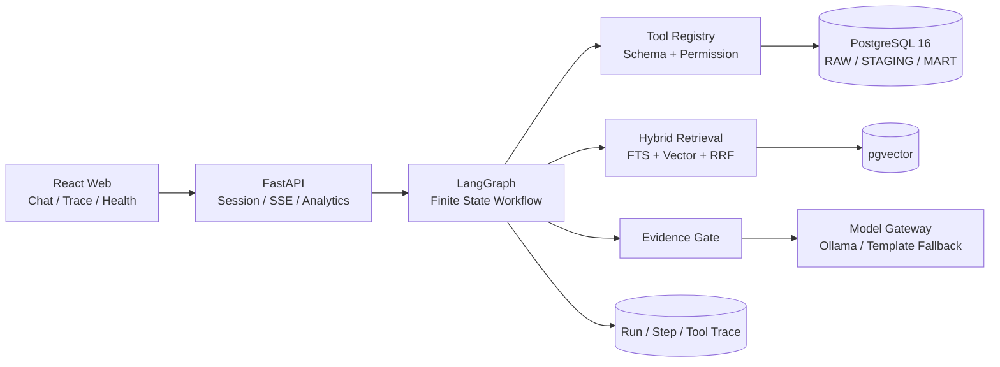
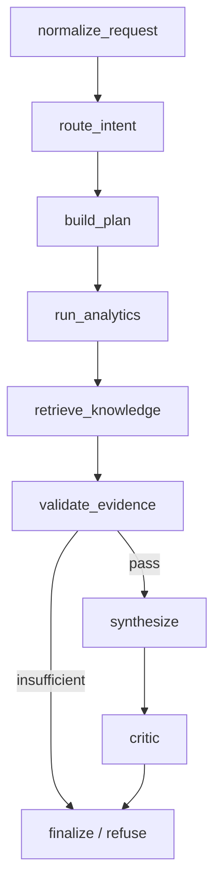
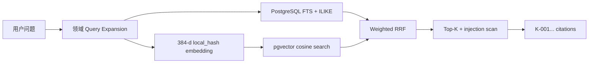

# 系统架构

## 边界

- API、Agent、Analytics、Knowledge、Trace 保持模块化，但在同一 Python 应用中部署。
- PostgreSQL 是业务数据、会话、Trace、知识与向量的统一存储。
- Tool Registry 是唯一工具业务实现；未来 MCP Server 只做只读适配。
- Ollama 在 Windows 宿主机便携运行，避免 Docker GPU 透传。

## 工作流

Analytics、权限、Evidence Gate 与 Critic 是确定性节点。模型仅在证据已通过时参与生成；本地模型不可用或 Critic 检查不通过时使用确定性模板。

## 混合检索

默认权重为 FTS `0.75`、Vector `0.25`、RRF `k=60`。离线 `local_hash`
保障无 API Key 时仍能验证完整向量链路，但不是语义模型。替换 Embedding Provider
时必须重建向量并重新跑同一检索 Gold 集。

## 数据粒度

- `mart_order_fulfillment`：一行一个订单。
- `mart_seller_order_fulfillment`：一行一个订单与卖家组合。
- `mart_category_order_fulfillment`：一行一个订单与商品类别组合。
- `mart_review_analysis_base`：评论与订单履约特征。
- `mart_payment_analysis_base`：一行一个订单与支付方式组合。

先聚合再连接，避免多商品、多卖家订单重复计算金额和评分。
