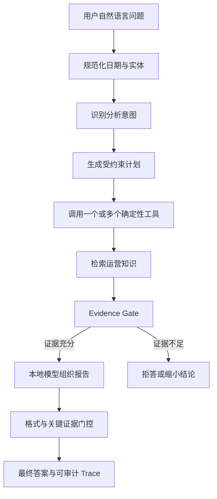

# 从零认识 OlistOps Agent

## 1. 它解决什么问题

普通数据分析经常经历以下过程：

1. 业务人员提出自然语言问题。
2. 分析师确认时间范围、指标口径和筛选条件。
3. 编写 SQL。
4. 检查多表连接是否重复计数。
5. 对照制度或 SOP 解释结果。
6. 整理成报告。
7. 保存查询参数和证据，以便复核。

OlistOps Agent 将这条链路做成了一个可审计的本地应用。它面向 Olist 匿名电商数据，重点分析订单状态、销售代理值、配送延期、运费、地区差异、支付方式、卖家表现和低分评论。

## 2. 为什么它是 Agent，而不只是报表

静态报表只能展示预先定义的图表。OlistOps Agent 接收用户问题后会动态执行一条有限状态工作流：



它具备 Agent 的几个核心特征：

- 能根据问题选择不同分析路径。
- 能组合多个工具，而不是只有一个固定查询。
- 有显式状态，记录时间范围、意图、计划、工具结果、知识片段和警告。
- 有停止条件、节点预算和工具权限。
- 有证据不足时的拒答路径。
- 能在模型失败时降级，而不是让整个任务失败。
- 每次运行都有 `run_id`，可以复查节点、工具参数与结果摘要。

## 3. 为什么不让模型直接生成 SQL

直接让大模型生成 SQL 的主要风险包括：

- 指标口径随 Prompt 改变。
- 多商品、多卖家、多支付记录连接后重复计数。
- 模型可能查询 RAW 中不应暴露的字段。
- 无法稳定复现面试或评测中的 Gold 结果。
- SQL 权限边界难以控制。

本项目采用“确定性 Analytics + 模型叙述”的方式：

```text
用户问题
  → 结构化参数
  → Pydantic 校验
  → allowlist 工具
  → 固定 SQL 查询 MART
  → MetricResult
  → 模型组织语言
```

因此，类似“2018 年 7 月订单量至少 20 的卖家延期排名”这样的数字由 SQL 重复计算，而不是由模型记忆或估算。

## 4. 系统的五层心智模型

### 4.1 数据层

- RAW：9 份原始 CSV，所有字段先按文本保存。
- STAGING：视图负责类型转换、空字符串处理和类别英文翻译。
- MART：按订单、订单—卖家、订单—类别、订单—支付方式等安全粒度生成物化视图。

### 4.2 Analytics 层

每个分析能力对应：

- 一个 Pydantic 输入模型。
- 一个固定工具名。
- 一个权限等级。
- 一段受控 SQL。
- 一个统一 `MetricResult` 输出。

### 4.3 Agent 层

LangGraph 负责规范化请求、路由、规划、运行工具、检索知识、验证证据、生成、
Critic 检查和结束。

### 4.4 Model 与 RAG 层

- PostgreSQL FTS 与 pgvector 向量候选通过 RRF 混合检索项目模拟政策。
- 本地 Ollama 模型只接收压缩后的工具结果和知识片段。
- 模型输出必须满足格式和关键证据检查。
- 缺失的知识引用由工作流确定性补充。
- Critic 不通过时回退到确定性证据模板。

### 4.5 应用与审计层

- FastAPI 提供会话、任务、SSE、Trace 和直接 Analytics API。
- React Web 展示健康状态、场景库、实时节点、工具调用和最终 Markdown。
- PostgreSQL 保存会话、运行、节点、工具和事件。

## 5. 一次真实请求发生了什么

输入：

```text
分析 2018 年全年的经营总览，包括订单状态、取消与不可用订单、
销售代理值、整体延期率和平均评分。
```

系统会：

1. 解析出 `2018-01-01` 到 `2018-12-31`。
2. 识别意图 `operations_overview`。
3. 生成三个结构化工具步骤：
   - `olist.get_operations_overview`
   - `olist.get_sales_summary`
   - `olist.get_delivery_performance`
4. 在 MART 上查询状态构成、销售摘要和整体配送指标。
5. 检索经营总览、指标定义和证据报告相关知识。
6. 检查结构化结果是否存在。
7. 把压缩证据交给 qwen2.5:3b。
8. 检查回答是否以 Markdown 标题开始、是否出现不允许的元推理。
9. 确定性补齐模型漏掉的 `K-xxx` 引用。
10. 保存完整 Trace 并通过 SSE 返回答案。

## 6. 可以分析哪些内容

### 经营与销售

- 订单状态构成。
- 取消和不可用订单数量。
- 已送达订单量。
- GMV 代理值。
- 平均订单商品金额。
- 运费占比。
- 平均评分。

### 履约

- 整体、卖家、类别延期率。
- 地区延期率。
- 延期订单量与合格分母。
- 平均延期天数。
- 平均配送天数。
- 延期与按时订单评分差。

### 成本和支付

- 整体、类别、州的运费占比。
- 平均每单运费。
- 支付方式金额构成。
- 参与订单量。
- 平均最大分期数。
- 平均支付序列数。

### 客户体验

- 低分评论匿名摘录。
- 延期与低分的描述性关联。
- 运营制度和处理规范引用。

## 7. 输出应该如何阅读

一份可靠回答应同时出现：

- 时间范围和筛选条件。
- 指标定义。
- 订单量、样本量或分母。
- 来自 Analytics Tool 的数字。
- `[K-001]` 形式的知识引用。
- 明确标记的事实、推断、建议和限制。

如果报告写了“延期导致低分”，应保持警惕。当前数据只能证明两组评分存在相关差异，不能自动证明因果关系。

## 8. 它不能做什么

- 不能回答实时业务现状。
- 不能可靠预测库存，因为数据没有完整库存字段。
- 不能读取真实客户身份。
- 不能发送邮件、创建工单或修改生产系统。
- 不能在当前版本中执行任意 SQL。
- 不能把支付金额解释为财务到账。
- 不能把 GMV 代理值解释为会计收入。
- 不能仅凭州、卖家或类别差异确认根因。

## 9. 十分钟体验路线

1. 确认 <http://127.0.0.1:8000/healthz> 返回 `ok`。
2. 打开 <http://127.0.0.1:5173>。
3. 点击“经营总览”并运行。
4. 观察 Trace 中三个工具。
5. 点击“地区履约”或“支付方式”再运行。
6. 打开 <http://127.0.0.1:8000/docs> 查看 API。
7. 使用 `run_id` 打开 `/api/v1/runs/{run_id}/trace`。
8. 阅读 [06_术语与指标口径.md](06_术语与指标口径.md) 核对数字含义。
