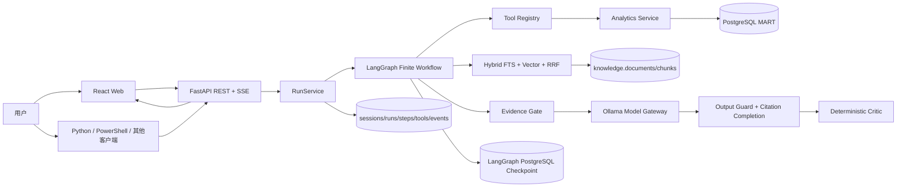
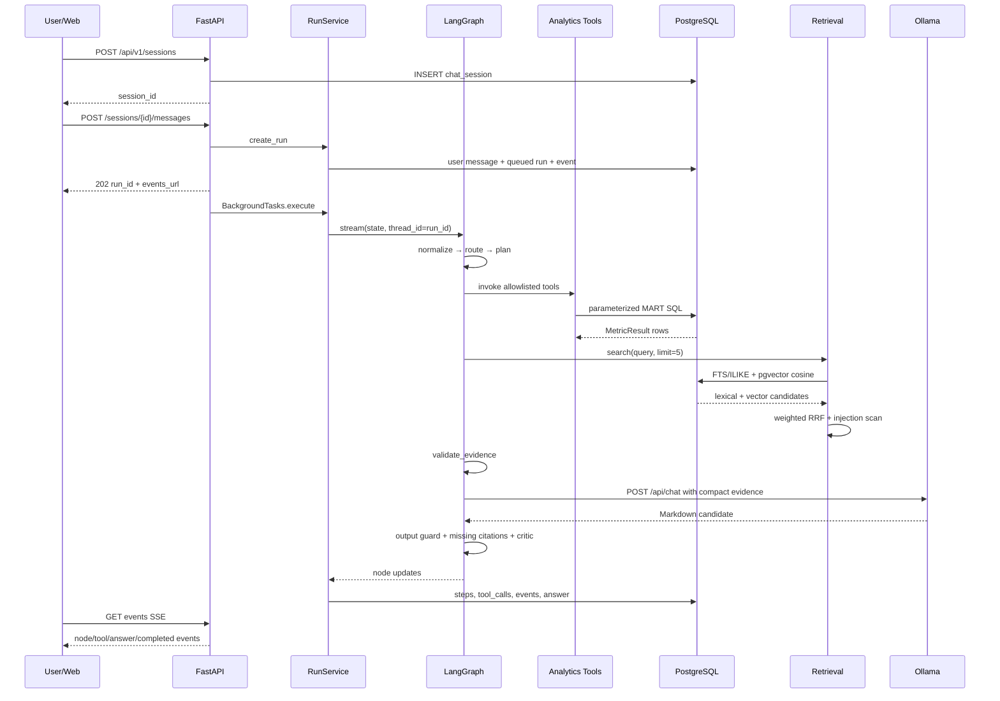

# OlistOps Agent 技术面试官项目全细节

本文是面向技术面试、架构评审和二次开发的单文件全解。内容以当前代码实际行为为准，同时明确哪些能力只是预留，避免把路线图描述成已完成实现。

## 0. 项目快照

| 项目 | 当前值 |
|---|---|
| 项目版本 | `0.2.0` |
| 运行平台 | Windows，本地单机 |
| Python | 3.12 |
| PostgreSQL | 16.14 |
| pgvector | 0.8.3 |
| FastAPI | 0.139.2 |
| LangGraph | 1.2.9 |
| LangGraph PostgreSQL Checkpoint | 3.1.0 |
| SQLAlchemy | 2.0.51 |
| psycopg | 3.3.4 |
| Pydantic | 2.13.4 |
| React | 19.2.8 |
| TypeScript | 5.8.3 |
| Vite | 7.3.6 |
| 本地模型 | Ollama `qwen2.5:3b` |
| 业务工具 | 10 个 READ 工具 |
| Agent 意图 | 10 类 |
| 知识库 | 16 篇模拟制度，60 chunks，60 embeddings |
| 自动测试 | 27 项 pytest + 两条模型 E2E + 检索 Gold |

## 1. 面试中的一句话介绍

我实现了一个本地运行、证据驱动、可审计的电商运营分析 Agent。系统不是让大模型生成任意 SQL，而是通过确定性的意图路由和 LangGraph 有限状态工作流，调用有 Pydantic Schema 和权限等级的 Analytics Tools；这些工具只查询经过粒度治理的 PostgreSQL MART。结构化指标和 PostgreSQL FTS + pgvector + RRF 混合检索出的运营规则通过 Evidence Gate 后才交给本地 Ollama 模型生成报告，随后再由确定性 Critic 检查结构、引用和提示泄漏。每次运行的节点、工具参数、检索排名、结果摘要、知识引用和最终答案都会持久化，并通过 SSE 展示实时 Trace。模型失败或 Critic 不通过时会降级到确定性模板。

## 2. 项目目标与非目标

### 2.1 目标

- 自然语言分析订单、销售、配送、地区、运费、支付、卖家和评论。
- 指标可复现，模型不负责算数或临时编写 SQL。
- 多表数据在 MART 层先处理粒度，避免重复计数。
- 所有工具有稳定名称、参数 Schema、权限和结果契约。
- 知识文档视为不可信数据，不能改变系统权限。
- 模型不可用时仍能给出有指标依据的报告。
- 每次运行可追踪、可复查、可作为评测样本。
- 所有运行时、数据和模型保存在项目目录。

### 2.2 非目标

- 不是实时 Olist 生产系统。
- 不进行个人识别。
- 不提供库存预测。
- 不执行任意 SQL。
- 当前不发送邮件、不建工单、不修改外部系统。
- 当前不提供公网级认证和多租户。
- 当前不把 `local_hash` 描述成正式语义 Embedding，也不宣称已完成模型 Reranker。
- 当前不宣称已完成可恢复审批工作流或批量评测平台。

## 3. 总体架构



### 3.1 为什么使用统一 PostgreSQL

同一个 PostgreSQL 实例同时承担：

- RAW/STAGING/MART 数据仓库。
- 会话与消息。
- Agent 运行和事件。
- LangGraph Checkpoint。
- 知识文档、FTS、pgvector 向量和检索日志。
- 预留评测表。

优点：

- 本地部署简单。
- 事务和审计统一。
- 不需要为 MVP 维护独立向量库、消息数据库和 Trace 服务。
- Analytics 与 RAG 可以共享连接与备份策略。

代价：

- 写入热点、分析查询和事件流会竞争同一数据库资源。
- 水平扩展能力有限。
- 生产环境需要拆分工作负载或使用只读副本。

## 4. 一次请求的完整时序



## 5. 技术栈选择

### FastAPI

用途：

- 自动 OpenAPI。
- Pydantic 请求验证。
- REST API。
- lifespan 资源管理。
- `BackgroundTasks` 执行本地任务。
- `sse-starlette` 输出 SSE。

为什么适合：

- Python 数据和 Agent 代码无需跨语言 RPC。
- Schema 可以复用于 Tool 与 API。
- 本地 MVP 启动成本低。

### LangGraph

用途：

- 显式 State。
- 有限节点图。
- 条件分支。
- `stream_mode="updates"` 节点更新。
- PostgreSQL Checkpoint。

为什么不是纯 Agent Loop：

- 业务分析需要可预测路径和稳定审计。
- 工具数量和权限必须受控。
- Evidence Gate 必须是确定性节点。
- 可以精确测试每个路由和步骤。

### SQLAlchemy + psycopg

- SQLAlchemy 用于应用查询、连接池和事务上下文。
- psycopg 用于 COPY、数据库初始化相关脚本和 LangGraph PostgresSaver。
- SQLAlchemy Engine 设置 `pool_pre_ping=True`、`pool_size=5`、`max_overflow=5`。

### PostgreSQL + pgvector

- PostgreSQL 承担结构化分析、FTS、知识和审计。
- pgvector 字段为 `vector(384)`，当前 60 个 Chunk 均已生成离线向量。
- 已建立 HNSW cosine 索引，并与 FTS 候选通过 Weighted RRF 融合。
- 当前 `local_hash` 是离线工程 fallback，不是正式语义 Embedding 模型。

### React + Vite

- React 负责场景、状态和事件流 UI。
- EventSource 原生支持 SSE。
- `react-markdown` 渲染模型报告。
- Vite 开发代理把 `/api` 与 `/healthz` 转发到 8000。

### Ollama

- Windows 便携运行，文件在项目目录。
- 避免 Docker GPU 透传和系统级服务依赖。
- 默认 qwen2.5:3b，在 RTX 4060 上全层 GPU 卸载。

## 6. 本地部署结构

```text
.runtime/conda/      Python + PostgreSQL + pgvector
.runtime/ollama/     Ollama 程序
data/postgres/       PostgreSQL cluster
data/raw/            CSV
models/ollama/       模型 blobs/manifests
.runtime/logs/       进程日志
```

PostgreSQL 使用 55432 而不是 5432，降低与系统 PostgreSQL 冲突的概率。

`postgres_runtime.py`：

- 自动 `initdb`。
- UTF-8、locale C。
- SCRAM 密码认证。
- 只监听 127.0.0.1。
- `max_connections=50`。
- `shared_buffers=256MB`。
- 时区 UTC。

当前本地开发数据库、用户和密码都是 `olistops`。这不是生产配置。

## 7. 配置系统

配置类：`packages/shared/config.py`

使用 Pydantic Settings 从项目根 `.env` 加载，并用 `lru_cache` 缓存。

| 配置 | 默认值 | 当前用途 |
|---|---|---|
| `APP_ENV` | development | 环境标识 |
| `APP_SECRET_KEY` | replace-me-before-sharing | 预留；当前认证未接入 |
| `API_HOST` | 127.0.0.1 | 启动配置参考 |
| `API_PORT` | 8000 | API |
| `WEB_ORIGIN` | 127.0.0.1:5173 | CORS |
| `DATABASE_URL` | PostgreSQL 55432 | SQLAlchemy |
| `WORKSPACE_ROOT` | `./workspace` | 安全产物根 |
| `MODEL_DEFAULT_PROFILE` | local_lite | run 记录 |
| `OLLAMA_BASE_URL` | 11434 | Model Gateway |
| `OLLAMA_MODEL` | qwen2.5:3b | 默认模型 |
| `EMBEDDING_PROVIDER` | local | 预留 |
| `EMBEDDING_MODEL` | 空 | 未启用 |
| `RERANKER_ENABLED` | false | 未启用 |
| `MAX_AGENT_STEPS` | 10 | LangGraph recursion_limit |
| `MAX_TOOL_CALLS` | 8 | 配置存在；固定计划天然低于此值，尚无统一动态计数器 |
| `MAX_RUN_SECONDS` | 120 | 配置存在；RunService 尚未强制取消超时任务 |
| `MAX_RESULT_ROWS` | 500 | 配置存在；当前各 Tool 自带 top-k/limit |
| `MAX_UPLOAD_MB` | 20 | 上传接口未实现 |
| `TRACE_CONTENT_MODE` | redacted | 当前摘要逻辑使用 redact_text；模式枚举未完全分支接入 |

面试时应坦诚：部分预算配置是架构预留，不等于当前每一项都已强制执行。

## 8. 数据来源和导入

原始数据为 9 个 Olist CSV：

| RAW 表 | 行数 |
|---|---:|
| customers | 99,441 |
| geolocation | 1,000,163 |
| orders | 99,441 |
| order_items | 112,650 |
| order_payments | 103,886 |
| order_reviews | 99,224 |
| products | 32,951 |
| sellers | 3,095 |
| category_translation | 71 |

### 导入策略

1. 下载脚本验证 9 个文件是否齐全。
2. ZIP 解压前验证每个目标路径不逃逸输出目录。
3. RAW 字段先按 text 保存，避免 CSV 类型异常导致导入失败。
4. 每张 RAW 表先 TRUNCATE，再使用 PostgreSQL COPY。
5. STAGING View 做类型转换。
6. MART 物化视图重建。

优点：

- COPY 速度快。
- RAW 保真。
- 类型问题集中在 STAGING。
- 重建过程可重复。

局限：

- 每张 RAW 表单独 commit；中途失败可能留下部分表为新数据、部分表为旧数据。
- MART 使用 DROP/CREATE，不是无停机刷新。
- 更成熟方案会使用批次 ID、影子 Schema 和原子切换。

## 9. 数据质量

质量报告检查：

- 行数。
- 主键重复。
- 外键孤儿。
- 时间先后异常。
- 缺失字段。
- 多商品、多卖家。
- 支付金额与商品加运费差异。

已知现象：

| 检查 | 数量 |
|---|---:|
| 重复 review_id | 814 |
| 多商品订单 | 9,803 |
| 多卖家订单 | 1,278 |
| 支付与商品+运费绝对差 > 1 | 1,022 |
| 已送达但缺实际送达日期 | 8 |
| 取消/不可用但有送达日期 | 6 |
| 送达早于承运时间 | 23 |
| 商品类别缺失 | 610 |
| 商品重量缺失 | 2 |
| 评论正文缺失 | 58,247 |

为什么不删除重复 review：

- RAW 必须保留源数据。
- `mart_review_analysis_base` 采用普通 review_id 索引。
- 订单 MART 对同一订单的评论先求平均和拼接，明确处理重复粒度。

## 10. MART 设计

### 10.1 `mart_order_fulfillment`

粒度：一行一个订单。

上游先聚合：

- items：item_count、seller_count、item_value、freight_value。
- payments：payment_value、max_installments。
- reviews：平均评分、标题拼接、正文拼接、首次评论时间。

再连接 orders/customers。

关键字段：

- `is_late`
- `late_days`
- `delivery_days`
- `item_value`
- `freight_value`
- `review_score`

### 10.2 `mart_seller_order_fulfillment`

粒度：一行一个 `order_id + seller_id`。

先在明细中按订单—卖家聚合，再连接订单 MART。防止一个卖家在同一订单多个商品行被重复统计。

### 10.3 `mart_category_order_fulfillment`

粒度：一行一个 `order_id + category`。

同一订单有多个类别时会出现多行，所以类别结果之间不能直接求和还原全站订单数。

### 10.4 `mart_review_analysis_base`

粒度：一行一个原始评论记录，并带订单履约特征。

用途：评论样本，不用于直接计算订单级销售金额。

### 10.5 `mart_payment_analysis_base`

粒度：一行一个 `order_id + payment_type`。

同一订单同一支付方式的多个序列先聚合：

- payment_value。
- max_installments。
- payment_sequence_count。

一个订单可以有多个 payment_type，因此参与订单量不是互斥集合。

### 10.6 月度 MART

- `mart_seller_performance_monthly`
- `mart_category_performance_monthly`

用于后续仪表盘或缓存扩展。当前主要工具仍查询基础 MART，以支持任意日期范围。

## 11. 指标与 SQL 方法

### 订单量

```sql
count(DISTINCT order_id)
```

### GMV 代理值

```sql
sum(item_value)
```

不是财务收入。

### 延期

```sql
delivered_at > estimated_at
```

### 延期率

```sql
count(DISTINCT order_id) FILTER (WHERE is_late)
/
count(DISTINCT order_id) FILTER (WHERE is_late IS NOT NULL)
```

保留合格日期分母，避免把日期缺失订单错误算成按时。

### 运费占比

```sql
sum(freight_value)
/
sum(item_value + freight_value)
```

### 时间范围

API 结束日期含当天。内部参数：

```python
end_exclusive = end_date + timedelta(days=1)
```

SQL 使用：

```sql
purchased_at >= :start_date
AND purchased_at < :end_exclusive
```

这比给 timestamp 拼 `23:59:59` 更安全。

## 12. 10 个 Analytics Tools

所有工具返回统一 `MetricResult`：

```text
metric_name
value
numerator
denominator
filters
definition
rows
data_freshness
warnings
```

### 12.1 `olist.get_sales_summary`

输入：DateRange。

输出：

- 已送达订单量。
- GMV 代理值。
- 平均订单商品金额。
- 运费占比。
- 平均评分。

### 12.2 `olist.get_delivery_performance`

输入：

- 日期。
- `group_by=overall|seller_id|category`
- `min_orders`
- `top_k`
- `delivered_only`

输出：

- 订单量。
- 合格履约分母。
- 延期订单量。
- 延期率。
- 平均延期天数。
- 延期/按时评分。

### 12.3 `olist.get_operations_overview`

按 order_status 汇总：

- 订单量与占比。
- 商品金额。
- 运费。
- 平均评分。

MetricResult 的 numerator 是 canceled + unavailable，denominator 是总订单。

### 12.4 `olist.get_monthly_trend`

按月输出：

- 总订单量。
- 已送达订单量。
- GMV 代理值。
- 运费。
- 合格配送分母。
- 延期订单和延期率。
- 平均配送天数。
- 平均评分。

### 12.5 `olist.get_geography_performance`

按匿名 customer_state：

- 订单量。
- 延期率。
- 平均延期/配送天数。
- 平均评分。
- GMV 代理值。

### 12.6 `olist.get_freight_analysis`

分组：

- overall
- customer_state
- category

输出：

- 商品金额。
- 运费。
- 运费占比。
- 平均每单运费。
- 评分。
- 延期率。

### 12.7 `olist.get_payment_analysis`

输出：

- 支付方式。
- 参与订单量。
- 支付金额。
- 支付金额占比。
- 平均最大分期数。
- 平均支付序列数。

### 12.8 `olist.compare_late_vs_on_time_reviews`

将已送达且有日期、有评分的订单分为 late/on_time。

`value = avg(late) - avg(on_time)`。

明确警告：关联不等于因果。

### 12.9 `olist.get_seller_diagnostic`

指定 32 位 seller_id：

- 规模。
- 商品金额。
- 平均订单金额。
- 运费占比。
- 延期率。
- 评分。
- 同行卖家均值。

同行只保留至少 5 单的卖家。

### 12.10 `olist.search_review_samples`

输入：

- 日期。
- max_score 1—5。
- limit 1—100。
- late_only true/false/null。

评论正文最多 280 字符，不返回客户标识。

## 13. Tool Registry

`ToolDefinition` 包含：

```python
name
description
input_model
permission
handler
```

权限枚举：

- READ
- GENERATE
- PERSIST
- EXTERNAL_WRITE

调用过程：

1. `get(name)` 检查 allowlist。
2. PERSIST/EXTERNAL_WRITE 直接拒绝。
3. `input_model.model_validate(arguments)`。
4. 调用 Handler。

这样可以阻止：

- 未注册工具。
- 任意 SQL。
- 非法 group_by。
- 过大 top-k。
- 非法 seller_id。
- 未审批写入。

## 14. Agent State 与 LangGraph

核心 State 字段：

| 类别 | 字段 |
|---|---|
| 身份 | run_id、session_id、user_id |
| 请求 | user_query、time_range、entity_filters |
| 规划 | intent、plan |
| 执行 | analytics_results、tool_calls |
| 检索 | retrieval_query、retrieved_chunks |
| 门控 | evidence_status、warnings、errors |
| 输出 | draft_answer、model_used |
| 审批/产物 | approval_required、approval_id、artifacts |
| 预算 | budgets |

Graph 节点：

1. `normalize_request`
2. `route_intent`
3. `build_plan`
4. `run_analytics`
5. `retrieve_knowledge`
6. `validate_evidence`
7. `synthesize`
8. `finalize`

### 14.1 normalize

正则解析：

- 中文/数字月份。
- ISO 日期范围。
- 32 位 seller_id。
- “不少于/至少/minimum/min”最小订单量。

默认：

- 全数据范围 2016-09-01 至 2018-08-31。
- min_orders=20。

### 14.2 route

当前是确定性关键词，不是 LLM Tool Calling。

优先级：

1. seller_id
2. payment
3. geography
4. freight
5. trend
6. operations overview
7. delivery
8. review
9. sales
10. mixed

优点：

- 可测试。
- 延迟低。
- 不消耗模型。
- 路由结果稳定。

缺点：

- 同义词覆盖有限。
- 多意图和否定表达处理弱。
- 不能很好解决跨轮指代。

升级方向：

- 保留规则优先处理强标识。
- 增加结构化 LLM Router。
- 使用 tool-routing Gold 测试。
- 支持多意图 DAG，而不是单 intent。

### 14.3 plan

不是让模型自由规划，而是 `intent -> plan_map`。

经营总览会组合三个工具；地区会组合地区履约和州级运费；运费会组合整体和类别。

### 14.4 Evidence Gate

当前规则：

- 没有 Analytics 或没有任何 rows：insufficient。
- 需要知识但没找到知识：仍允许生成，但建议限制为数据观察。
- 否则 pass。

这是基础门控。更严格版本应验证：

- 所有报告数字能映射到工具字段。
- 必需引用覆盖率。
- 分母是否存在。
- 请求中的全部子问题是否被工具覆盖。

### 14.5 Checkpoint

优先使用 `PostgresSaver`：

- 以 run_id 作为 `thread_id`。
- 自动建立 checkpoint 表。
- autocommit。
- prepare_threshold=0。

连接失败时退回 `MemorySaver`。

注意：应用业务状态仍写 `app.agent_runs`；LangGraph Checkpoint 是另一套图状态持久化，两者目的不同。

## 15. RAG 实现

### 15.1 知识入库

`build_knowledge.py`：

1. 读取 `data/knowledge_seed/*.md`。
2. 用 Markdown Heading 维护 heading_path。
3. 目标约 600 字符分块。
4. 文档与 chunk 使用 SHA-256。
5. token_count 当前用 `len(chunk)//3` 粗估。
6. 生成 384 维 `local_hash` 向量。
7. 写入 documents/chunks 并记录 ingestion job。

### 15.2 检索算法

1. NFKC/小写归一化并生成中文二至四字 n-gram。
2. 根据配送、包装、评论、卖家、运费、支付和安全领域词做 Query Expansion。
3. 词法分支使用 `websearch_to_tsquery`、`ts_rank_cd`、`ILIKE`、
   `title_hits` 和 `lexical_hits`。
4. 向量分支生成 384 维查询向量并执行 pgvector cosine Top-K。
5. 使用 `0.75/(60+fts_rank) + 0.25/(60+vector_rank)` 融合。
6. 可选规则 Rerank 后返回最多 5 个。
7. 写 `knowledge.search_logs`，并对命中内容执行 Prompt Injection 扫描。

### 15.3 Prompt Injection

检测模式：

- `ignore previous instructions`
- 中文“忽略之前/以上/系统指令”
- `system prompt`

命中后：

- 添加 warning。
- 片段 content 替换为 `[Potential prompt injection redacted]`。
- 仍保留 chunk 身份用于审计。

局限：

- 正则无法覆盖复杂间接注入。
- FTS simple 对中文没有真正分词，当前主要依赖正则词项和 ILIKE。
- 更成熟方案应加入文档信任等级、解析隔离、内容分类和检索后安全模型。

### 15.4 当前 Hybrid RAG 做到了什么

数据库迁移已把字段固定为：

```sql
embedding vector(384)
```

当前 60 个 Chunk 已全部回填 `local_hash` 向量，建立 HNSW cosine 索引，并完成
FTS + Vector 双路召回和 Weighted RRF。检索 Gold 支持 Recall@5、MRR、Top-1
及耗时消融。

仍未完成的是正式语义 Embedding 和模型 Reranker。下一阶段应：

1. 增加正式中文 Embedding Provider。
2. 记录模型版本并全量重建向量。
3. 扩大到至少 80 条、含困难负例的盲测集。
4. 重新调 FTS/Vector 权重。
5. 只有排序仍不足时再引入 Cross-Encoder Reranker。
6. 增加 Citation Coverage、拒答准确率和 LLM-as-judge。

## 16. 模型网关

Ollama 连接：

```text
POST http://127.0.0.1:11434/api/chat
Content-Type: application/json
```

请求关键参数：

```json
{
  "model": "qwen2.5:3b",
  "stream": false,
  "think": false,
  "keep_alive": "10m",
  "options": {
    "temperature": 0.0,
    "num_ctx": 6144,
    "num_predict": 1200
  }
}
```

`httpx.Client(trust_env=False)` 的原因：

- 本机有系统代理时，localhost 请求可能被错误转发。
- 模型与 API 都是本机连接，不应经过代理。

### 16.1 模型输入

只传：

- 当前 query。
- 每个 Analytics 结果最多前 5 行。
- 每个知识片段最多 500 字符。
- K-xxx 标识。

不把数据库连接、工具权限或任意 SQL 交给模型。

### 16.2 输出门控

当前检查：

- 第一字符必须是 `#`。
- 禁止若干元推理标记。
- 配送分析必须包含第一卖家 ID。

若模型漏掉知识引用，工作流确定性追加缺失的 K-xxx 片段。

若门控失败：

```text
model_used = deterministic-template
```

### 16.3 当前门控局限

- 没有逐个核对模型报告中的所有数字。
- 拒绝标记是有限字符串集合。
- 没有 JSON Schema 结构化报告再渲染。

升级方案：

- 让模型输出结构化 Report AST。
- 数字引用工具字段路径。
- 在渲染前做字段级一致性校验。
- 将事实段完全由模板生成，模型只生成无数字的解释和建议。

## 17. API 如何连接

### 17.1 协议

- REST：HTTP/1.1 + JSON。
- 实时事件：SSE，响应 `text/event-stream`。
- 数据库：PostgreSQL wire protocol，SQLAlchemy/psycopg。
- 模型：Ollama HTTP `/api/chat`。
- Web 开发代理：Vite reverse proxy。

### 17.2 API 地址

```text
Base URL: http://127.0.0.1:8000
OpenAPI:  /docs
Schema:   /openapi.json
```

### 17.3 核心端点

| 方法 | 路径 | 状态码 | 说明 |
|---|---|---:|---|
| GET | `/` | 200 | API 元信息 |
| GET | `/healthz` | 200 | DB/pgvector/Ollama |
| POST | `/api/v1/sessions` | 201 | 创建会话 |
| GET | `/api/v1/sessions/{id}` | 200/404 | 会话与消息 |
| POST | `/api/v1/sessions/{id}/messages` | 202/404 | 创建运行 |
| GET | `/api/v1/runs/{id}/events` | 200 | SSE |
| GET | `/api/v1/runs/{id}/trace` | 200/404 | 审计 Trace |
| GET | `/api/v1/tools` | 200 | 工具和 JSON Schema |

### 17.4 Analytics 端点

| POST 路径 | 请求模型 |
|---|---|
| `/api/v1/analytics/sales-summary` | DateRange |
| `/api/v1/analytics/operations-overview` | DateRange |
| `/api/v1/analytics/monthly-trend` | MonthlyTrendRequest |
| `/api/v1/analytics/delivery-performance` | DeliveryPerformanceRequest |
| `/api/v1/analytics/geography-performance` | GeographyPerformanceRequest |
| `/api/v1/analytics/freight-analysis` | FreightAnalysisRequest |
| `/api/v1/analytics/payment-analysis` | PaymentAnalysisRequest |
| `/api/v1/analytics/review-comparison` | DateRange |
| `/api/v1/analytics/seller-diagnostic` | SellerDiagnosticRequest |
| `/api/v1/analytics/review-samples` | ReviewSampleRequest |

### 17.5 会话调用示例

```python
import httpx

client = httpx.Client(
    base_url="http://127.0.0.1:8000",
    trust_env=False,
)

session = client.post(
    "/api/v1/sessions",
    json={"title": "Interview demo"},
).json()

accepted = client.post(
    f"/api/v1/sessions/{session['id']}/messages",
    json={"content": "分析 2018 年各州地区履约，至少 100 单。"},
).json()

print(accepted["run_id"])
print(accepted["events_url"])
```

### 17.6 SSE

可订阅事件：

- run.queued
- run.started
- node.started
- node.completed
- tool.completed
- assistant.delta
- run.completed
- run.failed
- heartbeat

`after` 参数用于断线续读：

```text
GET /api/v1/runs/{id}/events?after=100
```

当前事件轮询数据库间隔 0.25 秒，每次最多取 100 条；每 40 个空闲轮询发送应用级 heartbeat，EventSourceResponse 另设置 ping=15 秒。

### 17.7 当前 SSE 语义细节

`RunService` 使用 LangGraph `stream_mode="updates"`，节点计算完成后才拿到 node output。当前代码随后依次写 `node.started` 和 `node.completed`，因此 `node.started` 的持久化时间实际接近节点完成时间，不是严格的执行前事件。

这是一个面试中值得主动指出的语义技术债。正确做法可以使用节点执行 wrapper 或 LangGraph callback，在调用前写 started，调用后写 completed。

### 17.8 当前答案流

模型网关 `stream=false`，所以 `assistant.delta` 是完整答案而不是 Token delta。前端使用 append 写法，为未来 Token Stream 保留兼容性。

## 18. 持久化和审计

### 18.1 会话

- `app.chat_sessions`
- `app.chat_messages`

message role：

- user
- assistant
- tool
- system

### 18.2 Agent

- `app.agent_runs`
- `app.agent_steps`
- `app.tool_calls`
- `app.agent_events`

### 18.3 运行状态

run status：

- queued
- running
- completed
- failed
- 代码对 cancelled 有读取兼容，但取消 API 未实现。

### 18.4 保存内容

agent_runs.state 保存 allowlist 字段。retrieved_chunks 在保存前删除 content，只保留 chunk metadata，降低文档正文重复保存。

工具表保存：

- name。
- permission。
- arguments。
- result_summary。
- error。
- 时间。

### 18.5 审批与产物

已建表：

- `app.approvals`
- `app.artifacts`

但当前没有：

- 审批创建 API。
- 审批决定 API。
- Graph interrupt。
- resume。
- PERSIST Tool。

因此当前是“权限和 Schema 预留 + 写操作硬阻断”，不是完整 Human-in-the-loop。

## 19. BackgroundTasks 与并发

消息提交返回 202 后，FastAPI `BackgroundTasks` 在同一应用进程执行。

优点：

- 简单。
- 本地演示无需 Redis/Celery。
- 易调试。

局限：

- API 进程退出时任务可能丢失。
- 多 Worker 时没有统一所有权。
- 没有 retry、dead letter、租约和取消。
- CPU/DB/模型竞争可能阻塞应用。

生产升级：

- 独立 Worker。
- Redis Streams、RabbitMQ、PostgreSQL queue 或云队列。
- run lease。
- 幂等执行。
- retry policy。
- 超时与取消。
- per-user 并发配额。

## 20. 前端实现

状态：

- health
- query
- answer
- timeline
- running
- error
- sessionId

流程：

1. 页面加载 GET `/healthz`。
2. 首次运行创建 session，后续复用。
3. 提交 message。
4. 创建 EventSource。
5. tool.completed 加入时间线。
6. assistant.delta 追加报告。
7. completed/failed 关闭连接。

七个预置场景只是填充问题，不绕过 Agent。

当前前端没有：

- 会话列表。
- 历史回答卡片。
- Trace 展开查看参数。
- 运行取消。
- 审批 UI。
- 文件上传。
- 图表。
- 导出正式报告。

## 21. 安全设计

### 21.1 网络

- API、Web、Ollama、PostgreSQL 绑定 loopback。
- CORS 只允许配置的 Web origin。
- Ollama 设置 `OLLAMA_NO_CLOUD=true`。

### 21.2 参数

- Pydantic。
- Literal allowlist。
- 上下限。
- seller regex。
- SQL 绑定参数。
- 动态 SQL 片段只从代码中的固定 map 选择。

### 21.3 工具

- 工具 allowlist。
- 权限枚举。
- PERSIST/EXTERNAL_WRITE 拒绝。
- 模型不能新增工具。

### 21.4 文件

`safe_workspace_path` resolve 后确认仍在 workspace 内，防止 `../`。

下载 ZIP 解压前检查路径逃逸。

### 21.5 Prompt Injection

- 系统指令和文档内容分层。
- 文档作为证据数据。
- 注入正则。
- 命中内容替换。

### 21.6 Trace

`redact_text`：

- 压缩空白。
- 280 字内保存。
- 超长时截断并加 SHA-256 前 12 位。

但必须坦诚：

- `app.chat_messages` 保存完整用户问题。
- 最终答案保存完整。
- run failed 保存截断 message 和 traceback。
- 当前没有字段级加密和保留策略。

### 21.7 生产安全缺口

- 没有认证中间件。
- api_keys 表未接入。
- local-analyst 默认用户未用于请求鉴权。
- 没有 TLS。
- 默认数据库密码弱。
- APP_SECRET_KEY 未用于真实签名。
- 没有租户隔离。
- 没有速率限制。
- 没有 CSRF 专项处理。
- 没有审计日志不可篡改存储。

所以只能本地使用。

## 22. 测试与评测

### 22.1 Unit

- 中文月份解析。
- 样本门槛解析。
- 配送路由优先。
- seller ID 优先。
- 5 个扩展意图路由。
- Tool 输入验证。
- 写权限拒绝。
- Prompt Injection。
- Trace 摘要。
- Workspace 路径穿越。

### 22.2 Integration

- PostgreSQL 16 和 pgvector。
- 2018-07 卖家 Gold。
- overall 配送。
- 知识检索。
- 经营状态分母。
- 月度顺序。
- 地区样本门槛。
- 运费比例。
- 支付构成。

### 22.3 E2E

`smoke_test.py`：

- 健康。
- session/message。
- delivery_analysis。
- 3 工具。
- Gold seller。
- 模型非模板回退。
- Markdown 标题。
- K-001。

`scenario_smoke_test.py`：

- operations_overview。
- operations/sales/delivery 三工具。
- 模型与引用。

### 22.4 当前 27 项测试不等于生产完整

缺少：

- API 鉴权测试。
- SSE 断线集成测试。
- 并发压测。
- 数据重建故障注入。
- 模型多场景一致性批测。
- 80 条以上、与调参隔离的 RAG 盲测集。
- Prompt Injection 大规模对抗集。
- 浏览器 E2E。

## 23. 性能

已观察：

- 100 万 geolocation RAW COPY 约 1.2 秒，本机项目盘环境。
- 新增完整数据重导和 MART 重建约十几秒。
- 经营总览模型 E2E 约十几秒量级。
- qwen2.5:3b 模型 buffer 约 1.8GB，37/37 layers GPU。

SQL 优化：

- purchase 时间索引。
- seller/category/payment type 索引。
- unique grain 索引。
- FTS GIN。
- pgvector HNSW cosine。
- top-k。
- 先聚合后连接。

瓶颈：

- 非流式模型生成。
- 同进程 BackgroundTasks。
- FTS 中文 simple config。
- 当前 local_hash 缺少真正语义表达能力。
- Trace 0.25 秒数据库轮询。
- 每个 tool 单独连接，`_freshness()` 额外查询。

优化方向：

- 一次 run 复用连接/事务快照。
- freshness 缓存。
- monthly MART。
- SSE 使用 LISTEN/NOTIFY。
- 模型流式输出。
- 结果缓存 key=tool+normalized args+data version。
- 独立 Worker。

## 24. 可靠性和一致性

### 模型故障

降级模板，不让确定性分析失败。

### Checkpoint 故障

PostgresSaver 连接失败退回 MemorySaver，但业务数据库不可用时 API 运行记录仍无法工作。

### API 进程重启

已 queued/running 的 BackgroundTasks 不会自动恢复。run 可能停留 running，需要 reconciliation job。

### 重复提交

当前每次提交创建新 run，没有 idempotency key。客户端重试可能产生重复任务。

生产方案：

- 客户端 request_id 唯一约束。
- run lease。
- 恢复扫描。
- outbox。
- 幂等 Tool。

## 25. 主要设计取舍

### 为什么规则路由而不是 LLM Router

当前工具数量小，规则可测试、快速、离线。缺点是语义覆盖不足。路线是规则处理强约束 + LLM 结构化路由处理模糊问题。

### 为什么 MART 而不是直接查 RAW

控制粒度、类型、口径和性能，防止模型或临时 SQL制造重复计数。

### 为什么模型只做 synthesis

把概率性组件限制在解释层。Analytics Gold 可以做到 100% 可复现。

### 为什么用 SSE

浏览器原生、单向事件足够、比 WebSocket 简单。若未来需要客户端中断、审批双向交互，可用普通 REST 指令配合 SSE，未必必须 WebSocket。

### 为什么本地模型

数据不出本机、演示不依赖云 Key、成本可控。代价是质量和速度受硬件限制。

### 为什么保留模板回退

企业 Agent 的核心任务不应因为模型临时不可用完全中断。模板也能输出确定性指标、知识引用和限制。

## 26. 当前最重要的技术债

按优先级：

1. 正式认证、授权、租户隔离。
2. 可靠任务队列、取消、超时和恢复。
3. 结构化报告 AST 与数字字段级验证。
4. 正式中文语义 Embedding 与模型 Reranker。
5. 多意图和多轮上下文。
6. Human-in-the-loop interrupt/resume。
7. 扩大评测 Gold、盲测和批量实验。
8. 真正 Token Streaming。
9. 会话/Trace/产物完整 UI。
10. 数据批次和无停机 MART 切换。

## 27. 生产化路线

### Phase A：可控内部试用

- API Key/JWT。
- RBAC。
- HTTPS。
- Postgres 独立实例。
- 数据库密码与 Secret Manager。
- Background Worker。
- 运行取消/超时。
- 日志脱敏和保留。

### Phase B：Agent 质量

- LLM 结构化 Router。
- 多意图 DAG。
- 正式语义 Embedding、模型 Reranker 与困难负例评测。
- 报告 AST。
- 字段级引用。
- 批量 Eval。

### Phase C：写操作

- Graph interrupt。
- approvals API。
- 审批 UI。
- PERSIST Tool。
- Artifact hash/version。
- External Write 适配器与二次确认。

### Phase D：规模

- 多租户。
- 队列。
- 缓存。
- 读副本。
- 资源配额。
- 可观测性平台。
- SLO。

## 28. 高频技术面试问答

### Q1：这和普通 RAG Chatbot 有什么不同？

普通 RAG Chatbot 主要做检索和生成。本项目先执行确定性业务工具，RAG 只提供制度证据，模型在 Evidence Gate 后组织报告；同时有工具权限、结构化指标、Graph 状态和运行审计。

### Q2：为什么不让 LLM 生成 SQL？

因为业务指标需要稳定口径，复杂订单数据存在多商品、多卖家、多支付的粒度爆炸。固定工具更容易做权限、Gold 测试和分母审计。

### Q3：如何避免重复计数？

先在各自源表按目标粒度聚合，再连接订单 MART；所有订单量使用 `count(distinct order_id)`。并明确不同 MART 的 grain。

### Q4：API 是怎么连接的？

客户端通过 REST JSON 创建 session 和 run，通过 SSE 读取事件；API 通过 SQLAlchemy/psycopg 连接 PostgreSQL，通过 HTTPX 调 Ollama `/api/chat`；Web 开发时由 Vite 代理到 FastAPI。

### Q5：SSE 为什么不是 WebSocket？

当前交互主要是服务器向客户端单向发送状态和结果，SSE 足够且浏览器原生支持断线重连。客户端动作仍可通过 REST。

### Q6：如何保证模型不胡编数字？

数字由 Tool 计算；模型输入只包含压缩证据；配送关键对象有输出门控；不合格回退模板；缺失引用确定性补齐。当前尚未做到所有数字字段级验证，这是下一步。

### Q7：模型挂了怎么办？

健康检查失败、请求异常或输出门控失败时使用确定性模板。结构化分析和 API 仍可用。

### Q8：为什么 LangGraph？

它让状态、节点、分支、checkpoint 和流式更新显式化，适合需要证据门控、审计和未来审批恢复的业务 Agent。

### Q9：Checkpoint 和 app.agent_runs 有什么区别？

Checkpoint 保存 LangGraph 内部状态版本；agent_runs/steps/tools/events 是业务审计模型，便于 UI、查询和评测。两者互补。

### Q10：RAG 用了什么方法？

当前是 PostgreSQL FTS `websearch_to_tsquery` + `ts_rank_cd` + `ILIKE`
词法分支，以及 pgvector cosine 向量分支；两路候选通过 Weighted RRF 融合。
离线向量来自 384 维 `local_hash`，不冒充语义 Embedding。

### Q11：既然有向量检索，为什么仍以 FTS 为主？

`local_hash` 主要捕获词形重叠，16 条消融中纯 Vector 的 Recall@5 为 0.75，
明显弱于 FTS。因此当前权重为 FTS 0.75、Vector 0.25。换正式语义模型后必须用
盲测集重新调权，不能因为接了 pgvector 就让向量盲目主导。

### Q12：如何处理 Prompt Injection？

文档视为数据；检测中英文注入模式；命中片段正文替换；模型不能修改 Tool Registry；写权限由代码控制。

### Q13：Pydantic 的价值是什么？

在 API 和 Tool 边界统一验证日期、枚举、范围和 ID 格式，减少 SQL 分支和 Prompt 注入参数。

### Q14：动态 SQL 安全吗？

动态的表名、group expression 和 group clause 只从代码固定 map 选择，用户值全部绑定参数。用户不能提供原始 SQL 标识符。

### Q15：如何解释延期率分母？

只包含同时存在实际和预计送达日期的订单。日期缺失订单不能当作按时。

### Q16：为什么 GMV 叫代理值？

它只是商品 price 的和，没有退款、税费和财务确认，不应叫收入。

### Q17：为什么 payment order count 不能相加？

一单可能使用多种支付方式，payment MART 是 order + payment_type 粒度。

### Q18：当前并发能力如何？

SQLAlchemy pool 5+5，FastAPI 后台任务与 API 同进程，Ollama 本地推理是主要瓶颈。没有用户级并发配额和可靠队列，只适合本地 MVP。

### Q19：如何做幂等？

当前数据导入可重复但 run 提交无 idempotency key。生产应给请求加唯一 key、工具设计为幂等并加入 run lease。

### Q20：如何恢复失败任务？

当前只能通过 Trace 观察，不能自动恢复 BackgroundTask。虽然有 Checkpoint，但没有任务 reconciliation 和 resume API。

### Q21：审批实现了吗？

没有完整实现。表和权限等级存在，PERSIST/EXTERNAL_WRITE 被硬阻断；interrupt/resume 与审批 API 是下一阶段。

### Q22：多轮对话实现了吗？

页面复用 session 并保存历史，但路由主要看当前 query，没有完整 history summarization 和指代消解。

### Q23：如何评测？

当前有 Unit、Integration 和两条模型 E2E；规划了 retrieval、routing、analytics、security Gold。Analytics Gold 要求 100%，生成类用引用覆盖和 E2E 通过率。

### Q24：最值得展示的测试是什么？

2018 年 7 月卖家 Gold：71 单、30 延期、0.42254，第一 seller ID 固定。它证明结果来自 MART SQL 而不是模型。

### Q25：最需要重构的地方？

RunService。它同时负责执行、审计、事件和错误处理；生产应拆为 queue producer、worker executor、event store 和 reconciliation。

### Q26：如何支持云模型？

配置已预留 cloud fields，但 Gateway 只实现 Ollama。应增加 Provider Interface，根据 profile 路由，并保持同一 ModelResponse 和安全门。

### Q27：如何做真正流式输出？

Ollama `stream=true`，逐行读取 JSON chunk，RunService 逐段写 event；同时要处理中断、部分答案和最终校验。更安全的方案是结构化事实先发，模型解释再流式。

### Q28：为什么知识文件叫模拟制度？

避免把项目编写的政策冒充 Olist 官方制度。source_type 和 metadata 明确 `simulated=true`。

### Q29：如何防止文件路径穿越？

resolve root 和 candidate，确认 candidate 等于 root 或 root 在 candidate.parents 中；ZIP 也对每个 member 做同类检查。

### Q30：如果要部署到 Linux/Docker 怎么做？

应用代码跨平台，但当前 PowerShell、便携 PostgreSQL 和 Ollama Windows 安装脚本需要替换。可以为 API/Web/Postgres/Ollama 建 Compose，但 GPU、模型卷、健康检查和数据许可要单独设计。

## 29. 面试演示建议

### 5 分钟

1. 打开 Web 状态卡。
2. 运行配送 Gold。
3. 展示 3 个工具和报告。
4. 打开 Trace。
5. 解释“数字由 Tool，模型只生成语言”。

### 15 分钟

1. 运行经营总览。
2. 运行地区或支付场景。
3. 打开 Swagger `/api/v1/tools`。
4. 展示 MART grain。
5. 展示输出回退和权限。
6. 展示 Hybrid 消融，并主动说明正式语义 Embedding、审批和认证尚未实现。

### 30 分钟代码走读

顺序：

1. `analytics/schemas.py`
2. `analytics/service.py`
3. `analytics/tools.py`
4. `tools/registry.py`
5. `agent_runtime/workflow.py`
6. `api/run_service.py`
7. `api/main.py`
8. SQL MART
9. tests

## 30. 最后总结

这个项目的核心价值不是“用了多少框架”，而是把一个概率性模型限制在可验证系统边界内：

- 数据粒度由 MART 控制。
- 指标由确定性工具控制。
- 参数由 Schema 控制。
- 动作由权限控制。
- 生成由 Evidence Gate 控制。
- 失败由模板回退控制。
- 过程由 Trace 和 Checkpoint 记录。

当前版本已经是一个多场景、本地可运行、可审计的分析 Agent MVP；它仍有明确的生产差距，而这些差距已经被数据库预留、代码边界、测试计划和技术路线具体化。

## 31. v0.2：参考企业 RAG 与 Workflow Agent 后的实装增强

### 31.1 本轮不是简单复制参考仓库

本轮吸收了两个参考项目中与 OlistOps 场景匹配的设计：

- 企业 RAG：混合召回、引用、检索日志、消融评测和离线 fallback。
- Workflow Agent：可审计节点、RAG Trace、确定性 Critic 和失败回退。

工单、邮件、CRM、采购审批等副作用流程没有直接移植，因为 OlistOps 当前边界是
只读运营分析。架构增强应服务业务边界，不能为了堆功能引入无关写操作。

### 31.2 当前完整 RAG 调用链

```text
build_knowledge.py
  -> Markdown heading-aware chunks（目标约 600 字）
  -> LocalHashEmbedding(384)
  -> knowledge.documents / knowledge.chunks
  -> GIN FTS + HNSW vector index

RetrievalService.search(query, limit=5, mode="hybrid")
  -> expand_query
  -> _lexical_candidates
  -> _vector_candidates
  -> weighted RRF
  -> optional rule rerank slot
  -> prompt injection scan
  -> knowledge.search_logs

OlistOpsWorkflow.retrieve_knowledge
  -> safe_chunks
  -> validate_evidence
  -> synthesize
  -> critic
  -> finalize
```

### 31.3 local_hash 的具体方法

`LocalHashEmbedding` 先做 Unicode NFKC 和小写归一化。英文使用单词 Token；中文
抽取二、三、四字 n-gram。每个 Token 使用 BLAKE2b 生成稳定摘要，通过摘要计算
384 维桶位置和正负符号，并用 `1 + log1p(tf)` 累加，最终进行 L2 归一化。

为什么不用 Python `hash()`：它默认带进程级随机种子，不保证跨进程可复现。
BLAKE2b 在入库脚本、API 进程和测试进程中结果一致。

为什么 local_hash 不能叫语义 Embedding：它没有经过语义对比学习，主要捕获
Token/n-gram 重叠。项目消融中纯向量明显弱于 FTS，文档和面试必须如实说明。

### 31.4 PostgreSQL 与 pgvector

增量迁移把 `knowledge.chunks.embedding` 固定为 `vector(384)`，这样才能建立：

```sql
CREATE INDEX ix_chunks_embedding_hnsw
ON knowledge.chunks
USING hnsw (embedding vector_cosine_ops)
WHERE embedding IS NOT NULL;
```

查询相似度：

```sql
1 - (c.embedding <=> CAST(:embedding AS vector))
```

`<=>` 是 cosine distance。用 `1 - distance` 只是为了把结果展示为越大越相似；
RRF 实际融合的是排名，不直接把 cosine 与 `ts_rank_cd` 相加。

### 31.5 中文 FTS 为什么还需要 ILIKE

PostgreSQL `simple` parser 对英文较直接，但不会像中文分词器那样理解所有中文
词边界。因此当前词法分支组合：

- `websearch_to_tsquery('simple', ...)`
- `ts_rank_cd`
- 中文二至四字 n-gram
- 领域同义词扩展
- `ILIKE`
- `title_hits`
- `lexical_hits`

标题命中优先有助于小型制度库，但在大规模知识库中需要评估 BM25、PGroonga、
Elasticsearch/OpenSearch 或专用中文 Analyzer。

### 31.6 RRF 算法与权重

默认：

```text
0.75 / (60 + fts_rank) + 0.25 / (60 + vector_rank)
```

设置 0.75/0.25 不是拍脑袋。16 条项目内 Gold 的消融结果是：

| 模式 | Recall@5 | MRR | Top-1 |
|---|---:|---:|---:|
| Hybrid | 1.0000 | 1.0000 | 1.0000 |
| FTS | 1.0000 | 1.0000 | 1.0000 |
| local_hash Vector | 0.7500 | 0.5521 | 0.4375 |

本地哈希向量不足以占主导，因此当前让词法信号主导、向量作为补充。换成正式中文
Embedding 后必须重新跑消融，不能沿用旧权重。

### 31.7 新增知识 API

```text
GET  /api/v1/knowledge/status
GET  /api/v1/knowledge/documents
POST /api/v1/knowledge/search
```

检索请求：

```json
{
  "query": "配送延期和包装检查如何处理？",
  "limit": 5,
  "mode": "hybrid"
}
```

响应中的 `fts_rank`、`vector_rank`、`rrf_score`、`title_hits`、
`potential_injection` 允许面试官直接检查排序依据，而不是只看到最终答案。

### 31.8 Critic 做了什么

`critic` 是生成后的确定性节点，检查：

1. 答案非空。
2. 第一个字符是 Markdown 标题。
3. 至少有基本章节结构。
4. 所有期望的 `K-xxx` 均出现。
5. 没有引用不存在的编号。
6. 没有 `<think>`、Evidence 容器或系统提示泄漏。

失败时不让模型“再自由发挥”，而是回退到由结构化指标和已检索 Chunk 生成的
确定性模板。`critic_report` 随 Run State 持久化，包含分数、每项检查和是否修正。

它不是完整 LLM-as-judge：当前无法判断复杂语义忠实度或隐含矛盾。生产版本可增加
规则 Judge + 独立模型 Judge，但 Judge 也必须只看到必要证据并记录版本。

### 31.9 Trace 与前端变化

RunService 新增 `retrieval.completed` SSE 事件，包含：

- 检索模式。
- 命中数量。
- `K-xxx` 编号与标题。
- FTS 排名、Vector 排名、RRF 分数。

React 前端实时显示混合检索事件；系统状态卡显示已生成向量数。Trace 中还能看到
`critic` 节点与 `critic_score`。

### 31.10 新增评测方法

`scripts/evaluate_retrieval.py` 从 JSONL 读取 `query + gold_titles`，支持
`hybrid`、`fts`、`vector` 三种模式，并输出：

- Recall@K。
- MRR。
- Top-1 Accuracy。
- Mean Latency。
- 每个 Case 的召回标题和首个命中位置。

当前 16 条仅是回归集，不是有统计代表性的生产评测。下一阶段需要至少 80 条，
并把数据分成开发集和从未用于调权的盲测集，加入困难负例和无答案问题。

### 31.11 面试官可能继续追问

Q：既然 FTS 已经 1.0，为什么还要 Hybrid？

A：当前知识库只有 16 篇、查询与制度词汇接近，FTS 很强。Hybrid 的意义是先建立
可替换的向量工程链路和消融框架；不能用小样本 1.0 推断未来语义改写也能 1.0。

Q：为什么不用直接把 FTS score 和 cosine score 相加？

A：二者数值范围和分布不同，直接相加需要归一化且容易随模型变化。RRF 只使用
排名，跨检索器更稳健，也便于替换 Provider。

Q：HNSW 在 60 个 Chunk 上有意义吗？

A：性能上没有必要，顺序扫描也很快；它的价值是验证生产形态和迁移脚本。只有
扩大数据后，才能用 P95 延迟、召回率和内存成本决定 HNSW 参数。

Q：如何避免混用不同模型的向量？

A：metadata 记录 Provider、模型和维度；切换模型必须全量重建。生产还应增加
`embedding_version` 并在查询时只访问当前激活版本。

Q：接下来最值得做什么？

A：先接一个正式中文 Embedding Provider 并扩大盲测集，再做文档上传/版本/ACL。
如果检索仍有排序问题，再引入 Cross-Encoder Reranker，而不是先堆模型。
